# 🌞 Daily Briefing from UiPath Bot

This project generates a daily briefing containing:
- Weather forecast in Warsaw
- Current currency exchange rates
- Latest world news

All this information is gathered and sent to a specified recipient via email.

## 📝 Requirements
To run this project, you need the following:
- UiPath Studio with an active license.
- API key from OpenWeatherMap (available after registration at [OpenWeatherMap](https://openweathermap.org/)).
- Microsoft Outlook installed and available
- Creation of a `.env` file to store the environment variables.

## 🛠 How to Use

1. Download this repository.  
2. Open the project in **UiPath Studio** and install required packages.  
3. Create a `.env` file in the root directory as in the example:

```   
WEATHER_API=your_OpenWeatherMap_API_key 
RECIPIENT_EMAIL=your_email_address
```
 
4. Run the bot to automatically generate and send the briefing email.

## 📊 Flow Diagram

```mermaid
graph TD
  A[📥 Start: Load .env file] --> B[🔑 Extract API key & recipient email]
  B --> C[🌤️ Call OpenWeatherMap API]
  C --> D[🧾 Parse weather data] --> J1[📦 Add to email body]

  B --> E[💱 Fetch currency rates from NBP]
  E --> F[🧾 Parse exchange rate data] --> J2[📦 Add to email body]

  B --> G[📰 Fetch Google News RSS]
  G --> H[🧾 Parse XML feed]
  H --> I[🗂️ Get first 3 topics] --> J3[📦 Add to email body]

  J1 --> K[🧵 Compile final email body]
  J2 --> K
  J3 --> K

  K --> L[📧 Send email via Outlook]
  L --> M[🏁 End]
```




