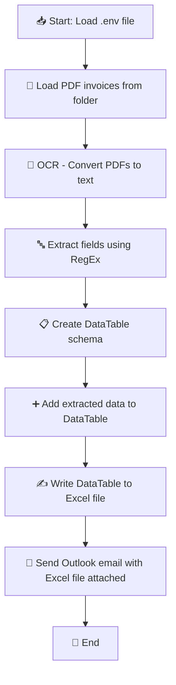

# ⚙️ Invoice Report Automation – UiPath Bot

This UiPath project automates the generation of invoice reports from pdf invoices using OCR and emails them to a specified recipient. It's structured for easy deployment and reuse.
Tested with a set of sample invoices, it extracts key details such as transaction, customer and product details. Only fields programmed in the bot are captured. Tested on a fixed set of invoice layouts.

---

## ✨ Features

- 📄 Processes invoice data using OCR
- 📊 Exports cleaned data to an Excel file named dynamically with today's date (e.g., `Invoice Report 2025-04-24.xlsx`)
- 🧠 Uses an `.env` file to store the recipient email (e.g., financial controller)
- 📧 Sends the Excel file via Outlook to a configured recipient
  
---

## 🗂 Project Structure

```
Invoice_OCR_to_Excel/
├── Main.xaml            # Main UiPath workflow
├── project.json         # UiPath project config and dependencies
├── Invoices/            # Folder containing .pdf invoices
├── Invoice Reports/     # Output folder for generated reports
├── .env                 # Contains recipient email config
├── README.md            # This file
```

---

## 🛠️ Setup

1. Download this repository
2. Open the project in **UiPath Studio** and install required packages
3. Create a `.env` file in the root directory with the following content:

   ```
   RECIPIENT_EMAIL=financial.controller@example.com
   ```

4. Ensure Microsoft Outlook and Excel are installed and available
5. Run the bot

---

## 🧰 Requirements

- UiPath Studio
- Microsoft Outlook (with configured profile)
- Microsoft Excel 
- Packages:
  - UiPath.Excel.Activities
  - UiPath.Mail.Activities
  - UiPath.System.Activities

---

## 📤 Email Logic

- Email subject: `"Invoice Report - [Today's Date]"`
- Email body: Includes a short message generated by the bot
- Attachment: Auto-generated Excel report with invoice data

---

## 📊 Flow Diagram




